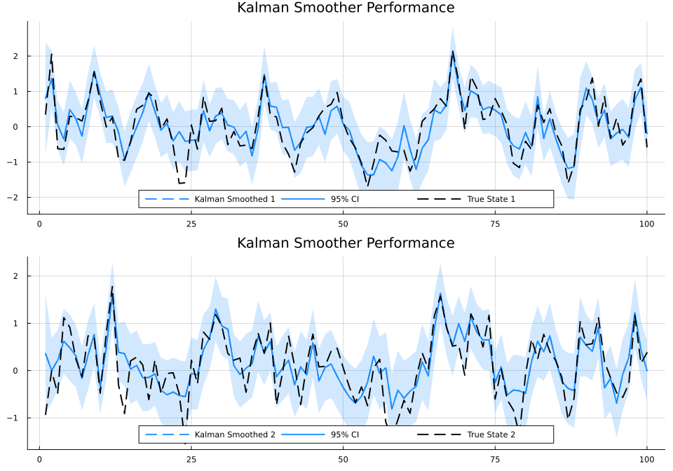
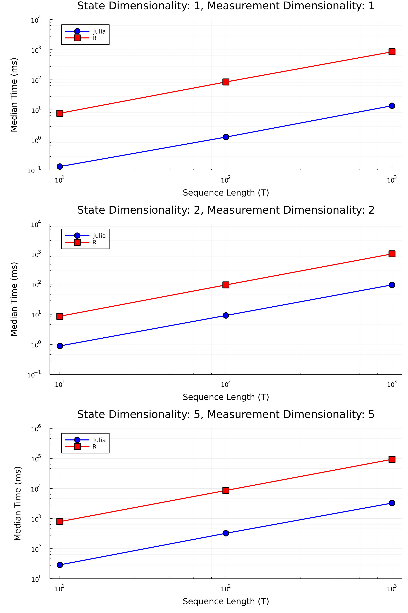

# QuadraticKalman.jl


[](https://github.com/dleather/QuadraticKalman.jl/actions/workflows/CI.yml?query=branch%3Amain)
[](https://codecov.io/gh/dleather/QuadraticKalman.jl)
[](https://quadratickalman.netlify.app)
[](https://doi.org/10.5281/zenodo.14908623)


A Julia package implementing Kalman filtering and smoothing for
state-space models with quadratic measurement equations, based on the
methodology developed in [Monfort et. al. (2013, Journal of
Econometrics)](https://www.sciencedirect.com/science/article/abs/pii/S0304407615000123).

The package implements filtering and smoothing for the following
state-space model with Gaussian noise:

State equation:

$X_{t} = \mu + \Phi X_{t-1} + \Omega \epsilon_t$, where
$\epsilon_t \sim \mathcal{N}(0, I).$

Measurement equation:

$Y_t = A + B X_t + \alpha Y_{t-1} + \sum_{i=1}^M e_i X_t^\prime C_i X_t + D \eta_t$,
where $\eta_t \sim \mathcal{N}(0, I)$ and $e_i$ is the basis vector.



## 📖 Documentation

👉 **[Read the Docs](https://dleather.github.io/QuadraticKalman.jl/)**

Check out the latest documentation for installation, API reference, and
usage examples.

## Features

- Kalman filtering and smoothing for quadratic state-space models.
- Extends original implementation by allowing for autoregressive
  measurement equations.
- Gradiant and hessian of negative log-likelihood computed using
  automatic differentiation using ForwardDiff.jl.
- Visualization tools for filtered and smoothed states.
- Efficient parameter-model conversion for optimization.
- Automatically reparametrizes model parameters to ensure
  positive-definiteness of covariance matrices in an unconstrained
  parameter space.
- Benchmarking results show an improvement in speed of 9.7x - 62x faster than R code depending on the dimensionality of the problem.
- Numerically stable implementation.
- TODO: Add support for state-dependent measurement noise.

## 📊 Package Metrics

[](https://github.com/dleather/QuadraticKalman.jl/stargazers)
[](https://github.com/dleather/QuadraticKalman.jl/network/members)
[](https://github.com/dleather/QuadraticKalman.jl/issues)
[](https://github.com/dleather/QuadraticKalman.jl/graphs/traffic)

QuadraticKalman.jl is gaining adoption within the Julia ecosystem:

- **40+ Package Downloads**: Users actively installing via the Julia package manager
- **16 Unique Users**: Researchers and developers across multiple domains
- **90+ Repository Views**: Growing interest in quadratic state-space modeling

> *Last updated: February 21, 2025*

### Who's Using QuadraticKalman.jl?

If you're using QuadraticKalman.jl in your research or projects, we'd love to know! Please consider:
- ⭐ Star the repository to help others discover it
- 🔍 Open an issue sharing your use case or results
- 📝 Submit a PR to add your project to this list

The package is especially valuable for:
- Econometric analysis with non-linear dynamics
- Financial modeling with quadratic effects
- Signal processing with state-dependent noise

## Installation

``` julia
using Pkg
Pkg.add("QuadraticKalman")
```

## Quick Start

``` julia
using QuadraticKalman, Random, Plots, LinearAlgebra
Random.seed!(2314)

# Define model parameters
N = 2  # Number of states
M = 2  # Number of measurements

# Generate stable state transition parameters
μ = [0.1, 0.2]                 # N x 1 vector
Φ = [0.5 0.1; 0.1 0.3]         # N x N matrix
Σ = [0.6 0.15; 0.15 0.4]       # N x N matrix
Ω = cholesky(Σ).L     

# Generate measurement parameters
A = [0.0, 0.0]                  # M x 1 vector
B = [1.0 0.0; 0.0 1.0]          # M x N matrix
C = [[0.2 0.1; 0.1 0.0],        # M x 1 vector of N x N matrices
     [0.0 0.1; 0.1 0.2]]    
V = [0.2 0.0; 0.0 0.2]          # M x M matrix
D = cholesky(V).L
α = zeros(M, M)                 # M x M matrix

# Simulate data (see example in Documentation)
# X, Y = ... simulation code ... # X is N x T and Y is M x T

# Create model and run filter/smoother
model = QKModel(N, M, μ, Φ, Ω, A, B, C, D, α)
data = QKData(Y)
results_filter = qkf_filter(data, model)
results_smoother = qkf_smoother(results_filter, model)

# Visualize smoothed states
p = plot(kalman_smoother_truth_plot(X, results_smoother))
savefig(p, "smoother_example.png")  # Save plot for README

# Parameter estimation example
params = model_to_params(model)
nll(p) = qkf_negloglik(p, data, N, M)
grad = ForwardDiff.gradient(nll, params)
hess = ForwardDiff.hessian(nll, params)
```
## Benchmarks
| T | N | M | Julia Median Time | Julia Min Time | R Median Time | R Min Time |
|-------|---|---|-------------------|----------------|---------------|------------|
| 10    | 1 | 1 | 0.13          | 0.12         | 7.74       | 7.13     |
| 100   | 1 | 1 | 1.24            | 1.19         | 84.90       | 80.73    |
| 1000  | 1 | 1 | 13.75          | 12.80        | 851.76      | 837.77   |
| 10    | 2 | 2 | 0.88           | 0.74         | 8.576       | 7.88     |
| 100   | 2 | 2 | 9.08          | 8.12         | 94.19      | 89.32    |
| 1000  | 2 | 2 | 94.49          | 87.56        | 1013.17     | 926.05   |
| 10    | 5 | 5 | 28.94         | 25.14        | 791.03      | 764.57   |
| 100   | 5 | 5 | 324.25        | 318.02       | 8591.90    | 8376.84  |
| 1000  | 5 | 5 | 3267.50       | 3249.10      | 93159.17    | 85904.42 |

*Note: Times are measured in milliseconds. Lower values indicate better performance. Benchmarked on 100 runs each. Julia code used `BenchmarkTools.jl` package where R code uses `microbenchmark` package. Effort was made to remove error-checking and compilation steps from R code to make comparison as relevant as possible.*




## Citations

If you use this package in your research, please cite the original
paper:

``` bibtex
@article{monfort2015quadratic,
  title = {A Quadratic Kalman Filter},
  journal = {Journal of Econometrics},
  volume = {187},
  number = {1},
  pages = {43-56},
  year = {2015},
  issn = {0304-4076},
  doi = {https://doi.org/10.1016/j.jeconom.2015.01.003},
  url = {https://www.sciencedirect.com/science/article/pii/S0304407615000123},
  author = {Alain Monfort and Jean-Paul Renne and Guillaume Roussellet},
}
```

And please also consider citing this package directly:

``` bibtex
@software{leather2025quadratickalman,
  author = {Leather, David},
  title = {{QuadraticKalman.jl}: A Julia package for quadratic Kalman filtering},
  url = {https://github.com/dleather/QuadraticKalman.jl},
  version = {0.1.1},
  doi = {10.5281/zenodo.14908624},
  year = {2025},
}
```

## License

MIT License

Copyright (c) 2025 David Leather

Permission is hereby granted, free of charge, to any person obtaining a
copy of this software and associated documentation files (the
"Software"), to deal in the Software without restriction, including
without limitation the rights to use, copy, modify, merge, publish,
distribute, sublicense, and/or sell copies of the Software, and to
permit persons to whom the Software is furnished to do so, subject to
the following conditions:

The above copyright notice and this permission notice shall be included
in all copies or substantial portions of the Software.

THE SOFTWARE IS PROVIDED "AS IS", WITHOUT WARRANTY OF ANY KIND, EXPRESS
OR IMPLIED, INCLUDING BUT NOT LIMITED TO THE WARRANTIES OF
MERCHANTABILITY, FITNESS FOR A PARTICULAR PURPOSE AND NONINFRINGEMENT.
IN NO EVENT SHALL THE AUTHORS OR COPYRIGHT HOLDERS BE LIABLE FOR ANY
CLAIM, DAMAGES OR OTHER LIABILITY, WHETHER IN AN ACTION OF CONTRACT,
TORT OR OTHERWISE, ARISING FROM, OUT OF OR IN CONNECTION WITH THE
SOFTWARE OR THE USE OR OTHER DEALINGS IN THE SOFTWARE.

## Contributing

Contributions are welcome! Please feel free to submit a Pull Request.
