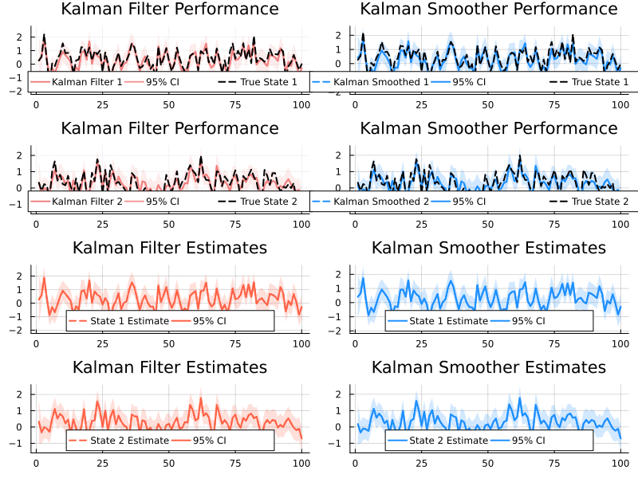

# QuadraticKalman.jl End-to-End Example


# Examples

This example demonstrates an end-to-end workflow using
QuadraticKalman.jl. In this example we simulate state and observation
data, run the Kalman filter and smoother, plot the results, and finally
compute the negative log-likelihood along with its gradients.

``` julia
using Pkg
Pkg.activate("..")  # Activate local environment
Pkg.develop(path="../../")  # Relative path to package root
Pkg.instantiate()

using QuadraticKalman
using Random, LinearAlgebra, Statistics, Plots

# Step 1: Set Parameters

N = 2                     # Number of states
M = 2                     # Number of measurements
T = 100                   # Number of time periods to simulate
seed = 2314               # Random seed for reproducibility
Random.seed!(seed)

# Generate stable state transition parameters
Phi = [0.5 0.1; 0.1 0.3]   # Autoregressive (state transition) matrix
mu = [0.1, 0.2]            # State drift vector
Sigma = [0.6 0.15; 0.15 0.4]  # State noise covariance matrix
Omega = cholesky(Sigma).L  # Scale for state noise

# Measurement parameters
A = [0.0, 0.0]             # Measurement drift vector
B = [1.0 0.0; 0.0 1.0]     # Measurement matrix linking state to observation
C = [[0.2 0.1; 0.1 0.0],   # Quadratic effect for first measurement
     [0.0 0.1; 0.1 0.2]]   # Quadratic effect for second measurement
V = [0.2 0.0; 0.0 0.2]     # Measurement noise covariance matrix
D = cholesky(V).L          # Scale for measurement noise
alpha = zeros(M, M)        # Measurement autoregressive matrix
```

      Activating project at `C:\Users\davle\Dropbox (Personal)\QuadraticKalman.jl\docs`
       Resolving package versions...
      No Changes to `C:\Users\davle\Dropbox (Personal)\QuadraticKalman.jl\docs\Project.toml`
      No Changes to `C:\Users\davle\Dropbox (Personal)\QuadraticKalman.jl\docs\Manifest.toml`

    2×2 Matrix{Float64}:
     0.0  0.0
     0.0  0.0

# Step 2: Simulate States

``` julia
X = zeros(N, T)
X[:, 1] = (I - Phi) \ mu   # Initialize state at the unconditional mean

for t in 1:(T-1)
    shock = randn(N)
    X[:, t+1] = mu + Phi * X[:, t] + Omega * shock
end
```

# Step 3: Simulate Observations

``` julia
Y = zeros(M, T)

for t in 1:T
    noise = randn(M)
    xt = X[:, t]

    # Linear component
    Y[:, t] = A + B * xt

    # Include autoregressive measurement component if t > 1
    if t > 1
        Y[:, t] += alpha * Y[:, t-1]
    end

    # Add quadratic effects for each measurement
    for i in 1:M
        Y[i, t] += xt' * C[i] * xt
    end

    # Add measurement noise
    Y[:, t] += D * noise
end
```

# Step 4: Define and Initialize the Model

``` julia
model = QKModel(N, M, mu, Phi, Omega, A, B, C, D, alpha)
```

    QKModel{Float64, Float64}
      state: StateParams{Float64}
      meas: MeasParams{Float64}
      aug_state: AugStateParams{Float64, Float64}
      moments: Moments{Float64}

# Step 5: Run the Filter and Smoother

``` julia
data = QKData(Y)
results = qkf_filter(data, model)
```

    FilterOutput{Float64}([-3.087750395108049, -4.939930927664772, -2.6477275243089635, -3.1576553696326664, -1.9052815714104239, -4.1769476631505995, -1.6935033668654287, -2.13426396116004, -2.1340930145033816, -2.1074807644710214  …  -2.100259148126778, -3.0137594321148606, -2.22259648678223, -3.377146866557334, -1.7831960017891193, -1.931171964648549, -2.5560556512930557, -2.1695267449366766, -2.682590284331289, -2.8648266407101572], [0.26470588235294124 0.5853873828377832 … -0.8570884921988308 -0.2926819397243644; 0.32352941176470595 -0.3312481785301867 … -0.11299635315934914 -0.7016298802146071; … ; 0.33074993010729054 0.11520325229356534 … 0.009478680835418488 0.24830052898521168; 0.5696112720970883 0.21457893632510366 … 0.34284210382744273 0.49517150011831085], [0.8388805054508017 0.24510979169898603 … 0.3362845201544028 0.15860045345228505; 0.24510979169898603 0.4649399918202716 … 0.20237257750209683 0.30084352411899934; … ; 0.3362845201544027 0.20237257750209683 … 0.6124750500120634 0.3588696510083117; 0.1586004534522851 0.3008435241189993 … 0.35886965100831153 0.6270018487705508;;; 0.17312523379161984 0.023608862954972987 … -0.0551751746079252 -0.03438169236875394; 0.023608862954972987 0.12582203374015086 … -0.0422042598784203 0.0022959189718310923; … ; -0.0551751746079252 -0.0422042598784203 … 0.3330965862509495 0.1444507893735511; -0.03438169236875394 0.0022959189718310923 … 0.1444507893735511 0.36416321249055017;;; 0.16679974858736044 0.023981367252595653 … -0.07581418296903858 -0.03604951462783851; 0.023981367252595653 0.1301328013205876 … -0.03293653474302455 -0.031185985614061558; … ; -0.07581418296903858 -0.03293653474302455 … 0.3365305566740948 0.15420254889546342; -0.03604951462783851 -0.031185985614061558 … 0.15420254889546342 0.33397277577618056;;; … ;;; 0.1560486848588631 0.020267879973959346 … -0.06141965539312404 -0.035989664781338436; 0.020267879973959346 0.1232297046647733 … -0.024870588219889703 -0.015020594569973999; … ; -0.06141965539312404 -0.024870588219889703 … 0.3182979559130559 0.15718552612146552; -0.035989664781338436 -0.015020594569973999 … 0.15718552612146552 0.35321883572698937;;; 0.17565324319928075 0.024987185795053803 … -0.06081612729603152 -0.027421981906941437; 0.024987185795053803 0.13450104091978105 … -0.04616090762285488 -0.022455039374552607; … ; -0.06081612729603152 -0.04616090762285488 … 0.29586612032127835 0.11527835922029794; -0.027421981906941437 -0.022455039374552607 … 0.11527835922029794 0.3143120204631132;;; 0.21970066226827512 0.0400671937056208 … -0.07469187583571194 -0.02985848870707012; 0.0400671937056208 0.15539592724797802 … -0.10475842725025375 -0.03852124963011891; … ; -0.07469187583571194 -0.10475842725025375 … 0.3110495882625459 0.11808756921454322; -0.02985848870707012 -0.03852124963011891 … 0.11808756921454322 0.33191367112266523], [0.5126458102950096 0.6184618621419649 … 0.3118936505812617 -0.17272430211250467; 0.5036016522055816 0.3127297041898411 … 0.2786355883807564 0.19057570984461966], [1.4883824890127502 0.4811035349089195; 0.4811035349089195 0.944515096481576;;; 1.2047577848321598 0.3178680270754939; 0.3178680270754939 0.7935763873743537;;; 1.7598674621394188 0.5412061715758834; 0.5412061715758834 1.0390905426838752;;; … ;;; 1.2711900480676357 0.3584799180750971; 0.3584799180750971 0.8516562788332701;;; 1.0275498479229406 0.2546256997031704; 0.2546256997031704 0.737427946080245;;; 0.7500293340954984 0.15239114374171328; 0.15239114374171328 0.6301919795632449], [0.6592758550938514 0.0284874631371413; 0.01885946795879832 0.5892016650229842; … ; 0.3012870584379126 0.266476682174057; 0.014095859989285782 0.5200935947053137;;; 0.6291193409528406 0.008043152307402091; 0.027861439491520253 0.5865413279222723; … ; 0.20948160265170357 0.3260194199026154; 0.022974838639881704 0.3322453725715688;;; 0.5611364893492655 -0.03602227100424997; 0.016053840187968193 0.5411238044429976; … ; 0.2687282224468873 0.6143777284353786; 0.003405977469262027 0.5340752993636161;;; … ;;; 0.621323897028858 0.003930091575092813; 0.020702369327466413 0.5762571821372293; … ; 0.25187339497943356 0.35108080059505187; 0.02033689033205061 0.4353013758554529;;; 0.6641251955740368 0.03669783306349923; 0.030780465686329007 0.6038891019379278; … ; 0.19607888740364945 0.18029019176378383; 0.017491922293797854 0.3173151665627431;;; 0.7311309346864417 0.09578562424009857; 0.03177937130913631 0.6336997958508744; … ; 0.1586176982080057 -0.09470474620985707; 0.021554828837083158 0.25739498345097755], [0.26470588235294124 0.35956887356587297 … 0.1216035300410312 -0.33984388141535027; 0.3235294117647059 0.15916428472472233 … 0.1510583251368311 0.08039224483231219; … ; 0.3307499301072905 0.30539758529775485 … 0.19740943789674278 0.11975864748645643; 0.5696112720970883 0.4624295120278391 … 0.44047687832288385 0.43115867757508086], [0.8388805120131 0.24510978858332944 … 0.3362845186951361 0.15860045518444077; 0.24510978858332944 0.46494000500163285 … 0.2023725777399268 0.300843518190752; … ; 0.3362845186951361 0.2023725777399268 … 0.6125055739408131 0.35886964749032824; 0.15860045518444077 0.300843518190752 … 0.35886964749032824 0.6270018608107402;;; 0.6469004150808039 0.1662083407745812 … 0.1507724209995231 0.04998477240219233; 0.1662083407745812 0.41447176715182815 … 0.16778936386324855 0.1314598446824392; … ; 0.1507724209995231 0.16778936386324855 … 0.5171341579522746 0.27046407663075733; 0.04998477240219233 0.1314598446824392 … 0.27046407663075733 0.4270619455471905;;; 0.6453994208763907 0.16608098359720685 … 0.3847286337289353 0.11616709831370804; 0.16608098359720685 0.4148188556382991 … 0.47115322937528614 0.30957781745851287; … ; 0.3847286337289353 0.47115322937528614 … 1.0003352452209917 0.5630867319337662; 0.11616709831370804 0.30957781745851287 … 0.5630867319337662 0.6730038241556993;;; … ;;; 0.6485470370248586 0.16692798876294285 … 0.21724210790881518 0.07851408263308356; 0.16692798876294285 0.4151392347205852 … 0.2086955305937882 0.20658045105533182; … ; 0.21724210790881518 0.2086955305937882 … 0.5672962650917526 0.33571570431163966; 0.07851408263308356 0.20658045105533182 … 0.33571570431163966 0.5214696239726682;;; 0.6422712630219363 0.16474218354034448 … 0.11019125943949454 0.046924574234562914; 0.16474218354034448 0.41386724407383957 … 0.07189166876036462 0.1245830994449413; … ; 0.11019125943949454 0.07189166876036462 … 0.37732588992907834 0.17763552619564676; 0.046924574234562914 0.1245830994449413 … 0.17763552619564676 0.39170379903807806;;; 0.6477570492441433 0.16681563892279522 … -0.0016639165811846574 0.02649177954412664; 0.16681563892279522 0.4153608703141013 … -0.12393918313394323 0.06811194924982959; … ; -0.0016639165811846574 -0.12393918313394323 … 0.3309750668666479 0.11120066496270306; 0.02649177954412664 0.06811194924982959 … 0.11120066496270306 0.3757046846394498])

# Step 6: Run the Smoother

``` julia
results_smoother = qkf_smoother(results, model)
```

    SmootherOutput{Float64}([0.41226348191322576 0.6465536726443549 … -0.8570884921988308 -0.2926819397243644; 0.17494188728427837 -0.3389761474083825 … -0.11299635315934914 -0.7016298802146071; … ; 0.33074993010729054 0.11520325229356534 … 0.009478680835418488 0.24830052898521168; 0.47562137880618954 0.2153990697596077 … 0.34284210382744273 0.49517150011831085], [0.6473919937880229 0.16342423872827566 … 0.3362845201544028 0.09713536521889135; 0.16342423872827563 0.4117152650229131 … 0.20237257750209683 0.2608254754484712; … ; 0.3362845201544027 0.20237257750209683 … 0.6124750500120634 0.3588696510083117; 0.09713536521889142 0.2608254754484711 … 0.35886965100831153 0.5968620948709361;;; 0.1670909077883467 0.021896857166740172 … -0.0551751746079252 -0.03401200362644092; 0.021896857166740172 0.12348644376033223 … -0.0422042598784203 0.001719582342586575; … ; -0.0551751746079252 -0.0422042598784203 … 0.3330965862509495 0.1444507893735511; -0.03401200362644092 0.0017195823425865749 … 0.1444507893735511 0.3638698564721054;;; 0.1628457970054769 0.022902371340623964 … -0.07581418296903858 -0.03551868213999756; 0.022902371340623954 0.12824000091785043 … -0.03293653474302455 -0.031153622189140105; … ; -0.07581418296903858 -0.03293653474302455 … 0.3365305566740948 0.15420254889546342; -0.03551868213999755 -0.031153622189140105 … 0.15420254889546342 0.3338676798910607;;; … ;;; 0.15018057050110642 0.018569119071709748 … -0.06141965539312404 -0.03545077502525556; 0.018569119071709748 0.12083822367746502 … -0.024870588219889703 -0.01531052117372246; … ; -0.06141965539312404 -0.024870588219889703 … 0.3182979559130559 0.15718552612146552; -0.03545077502525556 -0.01531052117372246 … 0.15718552612146552 0.35306474647495284;;; 0.17565324319928075 0.024987185795053803 … -0.06081612729603152 -0.027421981906941437; 0.024987185795053803 0.13450104091978105 … -0.04616090762285488 -0.022455039374552607; … ; -0.06081612729603152 -0.04616090762285488 … 0.29586612032127835 0.11527835922029794; -0.027421981906941437 -0.022455039374552607 … 0.11527835922029794 0.3143120204631132;;; 0.21970066226827512 0.0400671937056208 … -0.07469187583571194 -0.02985848870707012; 0.0400671937056208 0.15539592724797802 … -0.10475842725025375 -0.03852124963011891; … ; -0.07469187583571194 -0.10475842725025375 … 0.3110495882625459 0.11808756921454322; -0.02985848870707012 -0.03852124963011891 … 0.11808756921454322 0.33191367112266523])

# Display Log-Likelihood and Plot Results

``` julia
println("Filter Log-Likelihood: ", sum(results.ll_t))

plot(kalman_filter_truth_plot(X, results))
plot(kalman_smoother_truth_plot(X, results_smoother))
plot(kalman_filter_plot(results))
plot(kalman_smoother_plot(results_smoother))
```

    Filter Log-Likelihood: -263.0625463924433


# Step 7: Model-Parameter Conversion and Gradient Analysis

``` julia
params = model_to_params(model)
model_from_params = params_to_model(params, N, M)


# Compute negative log-likelihood function for automatic differentiation
nll(params) = qkf_negloglik(params, data, N, M)

using ForwardDiff, FiniteDiff

grad = ForwardDiff.gradient(nll, params)
grad_fd = FiniteDiff.finite_difference_gradient(nll, params)

println("Max absolute difference in gradients: ", maximum(abs.(grad - grad_fd)))
println("Hessian condition number: ", cond(ForwardDiff.hessian(nll, params)))
```

    Max absolute difference in gradients: 0.019281279928234474
    Hessian condition number: 5.8961011704491535e6

# Display Plots Properly

``` julia
p1 = plot(kalman_filter_truth_plot(X, results))
p2 = plot(kalman_smoother_truth_plot(X, results_smoother))
p3 = plot(kalman_filter_plot(results))
p4 = plot(kalman_smoother_plot(results_smoother))
plot(p1, p2, p3, p4, layout=(2,2), size=(800,600))
```


