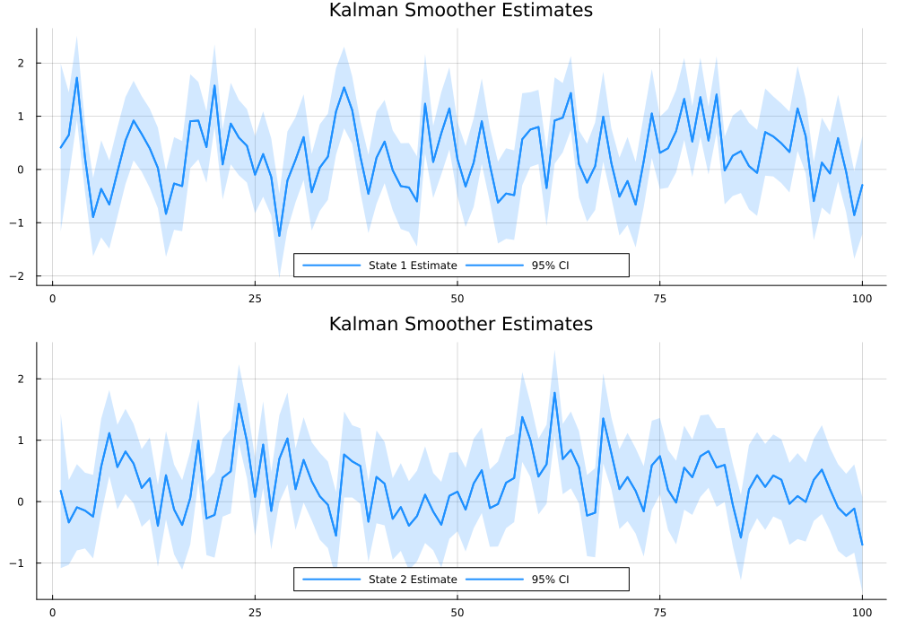
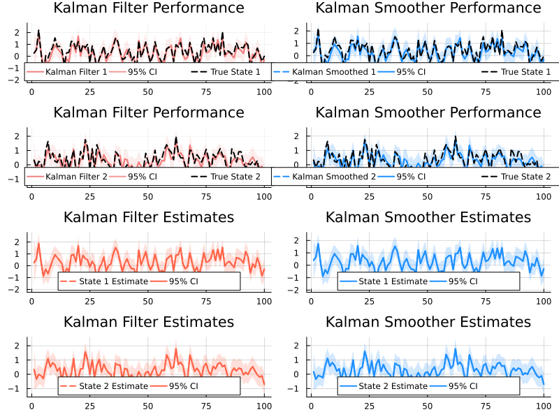

# QuadraticKalman.jl End-to-End Example


# Examples

This example demonstrates an end-to-end workflow using
QuadraticKalman.jl. In this example we simulate state and observation
data, run the Kalman filter and smoother, plot the results, and finally
compute the negative log-likelihood along with its gradients.

``` julia
using Pkg
Pkg.activate("..")  # Activate local environment
Pkg.develop(path="../../")  # Relative path to package root
Pkg.instantiate()

using QuadraticKalman
using Random, LinearAlgebra, Statistics, Plots

# Step 1: Set Parameters

N = 2                     # Number of states
M = 2                     # Number of measurements
T = 100                   # Number of time periods to simulate
seed = 2314               # Random seed for reproducibility
Random.seed!(seed)

# Generate stable state transition parameters
Phi = [0.5 0.1; 0.1 0.3]   # Autoregressive (state transition) matrix
mu = [0.1, 0.2]            # State drift vector
Sigma = [0.6 0.15; 0.15 0.4]  # State noise covariance matrix
Omega = cholesky(Sigma).L  # Scale for state noise

# Measurement parameters
A = [0.0, 0.0]             # Measurement drift vector
B = [1.0 0.0; 0.0 1.0]     # Measurement matrix linking state to observation
C = [[0.2 0.1; 0.1 0.0],   # Quadratic effect for first measurement
     [0.0 0.1; 0.1 0.2]]   # Quadratic effect for second measurement
V = [0.2 0.0; 0.0 0.2]     # Measurement noise covariance matrix
D = cholesky(V).L          # Scale for measurement noise
alpha = zeros(M, M)        # Measurement autoregressive matrix
```


# Step 2: Simulate States

``` julia
X = zeros(N, T)
X[:, 1] = (I - Phi) \ mu   # Initialize state at the unconditional mean

for t in 1:(T-1)
    shock = randn(N)
    X[:, t+1] = mu + Phi * X[:, t] + Omega * shock
end
```

# Step 3: Simulate Observations

``` julia
Y = zeros(M, T)

for t in 1:T
    noise = randn(M)
    xt = X[:, t]

    # Linear component
    Y[:, t] = A + B * xt

    # Include autoregressive measurement component if t > 1
    if t > 1
        Y[:, t] += alpha * Y[:, t-1]
    end

    # Add quadratic effects for each measurement
    for i in 1:M
        Y[i, t] += xt' * C[i] * xt
    end

    # Add measurement noise
    Y[:, t] += D * noise
end
```

# Step 4: Define and Initialize the Model

``` julia
model = QKModel(N, M, mu, Phi, Omega, A, B, C, D, alpha)
```

    QKModel{Float64, Float64}
      state: StateParams{Float64}
      meas: MeasParams{Float64}
      aug_state: AugStateParams{Float64, Float64}
      moments: Moments{Float64}

# Step 5: Run the Filter and Smoother

``` julia
data = QKData(Y)
results = qkf_filter(data, model)
```

    FilterOutput{Float64}(...)

# Step 6: Run the Smoother

``` julia
results_smoother = qkf_smoother(results, model)
```

    SmootherOutput{Float64}(...)

# Display Log-Likelihood and Plot Results

``` julia
println("Filter Log-Likelihood: ", sum(results.ll_t))


plot(kalman_filter_truth_plot(X, results))
plot(kalman_smoother_truth_plot(X, results_smoother))
plot(kalman_filter_plot(results))
plot(kalman_smoother_plot(results_smoother))
```

    Filter Log-Likelihood: -263.0625463924433



# Step 7: Model-Parameter Conversion and Gradient Analysis

``` julia
params = model_to_params(model)
model_from_params = params_to_model(params, N, M)


# Compute negative log-likelihood function for automatic differentiation
nll(params) = qkf_negloglik(params, data, N, M)

using ForwardDiff, FiniteDiff

grad = ForwardDiff.gradient(nll, params)
grad_fd = FiniteDiff.finite_difference_gradient(nll, params)

println("Max absolute difference in gradients: ", maximum(abs.(grad - grad_fd)))
println("Hessian condition number: ", cond(ForwardDiff.hessian(nll, params)))
```

    Max absolute difference in gradients: 0.019281279928234474
    Hessian condition number: 5.8961011704491535e6

# Display Plots Properly

``` julia
p1 = plot(kalman_filter_truth_plot(X, results))
p2 = plot(kalman_smoother_truth_plot(X, results_smoother))
p3 = plot(kalman_filter_plot(results))
p4 = plot(kalman_smoother_plot(results_smoother))
plot(p1, p2, p3, p4, layout=(2,2), size=(800,600))
```


